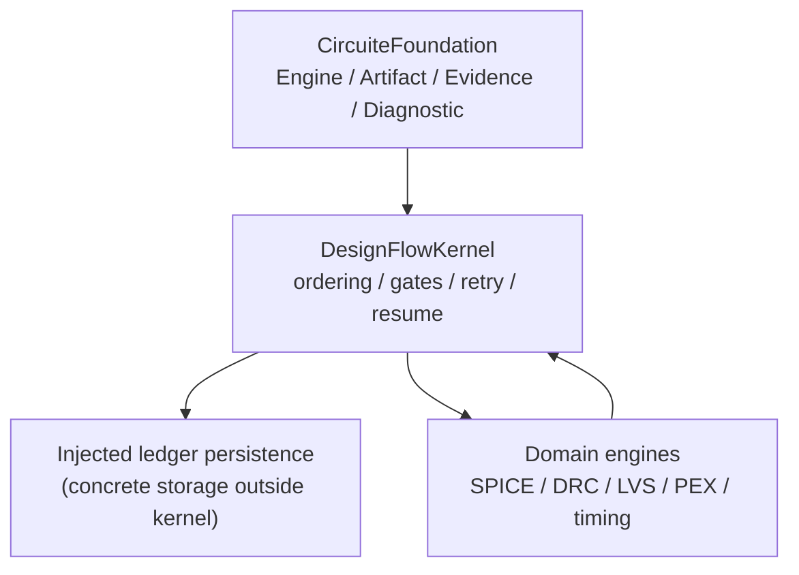

# DesignFlowKernel design

## Responsibility boundary

DesignFlowKernel coordinates a semiconductor design flow. It does not
implement domain algorithms and it does not become a project model. Domain
engines remain independently executable and are supplied through
`FlowStageExecutor`.

## Shared contract integration

- `FlowEngine` is the typed `CircuiteFoundation.Engine` boundary.
- `DefaultFlowEngine` invokes the orchestrator without a bridge or result
  projection layer.
- `FlowRunResult` directly provides `EvidenceManifest`, canonical artifact
  references, `DesignDiagnostic` values, and mandatory `ExecutionProvenance`.
- `FlowRunLedgerPersisting` is the asynchronous storage seam for run recovery.
  Implementations own durable writes and integrity checks; the kernel does not
  choose a filesystem layout.
- `FlowArtifactPersisting` is the canonical artifact seam. It persists, loads,
  and verifies `CircuiteFoundation.ArtifactReference` values while leaving the
  concrete namespace and filesystem boundary to the injected implementation.
- `FlowRunInfrastructure` composes artifact, run-control, workspace-preparation,
  progress, evidence, and ToolQualification artifact-reading capabilities for
  orchestration without introducing a storage facade.
- `FlowOperationRequest`, stage results, and the run ledger remain domain and
  persistence models owned by this package.

## Runtime flow

1. A caller creates a `FlowEngineRequest` with a `FlowOperationRequest`, tool
   registry, health results, and stage executors.
2. `DefaultFlowEngine.execute` delegates to `DefaultFlowOrchestrator`.
3. The orchestrator validates the plan, selects trusted tools, executes stages,
   records diagnostics and artifacts, and applies approval gates.
4. A `FlowRunLedgerPersisting` implementation persists the run so a later
   invocation can resume the same run. The composing application supplies the
   concrete storage implementation bound to a validated `FlowWorkspaceID`.
5. The orchestrator emits a `FlowRunResult` whose evidence and diagnostics are
   immediately consumable through CircuiteFoundation protocols.
6. Review artifacts embed `ArtifactReference` as the single source of artifact
   identity, location, role, kind, format, digest, and byte count. DesignFlowKernel
   stores only review-domain metadata such as the validated open-token
   `FlowRunReviewArtifactPurpose`, `stageID`, and the verification result beside
   that reference.

## Deliberate non-goals

- No universal result envelope is introduced.
- No project lifecycle or UI state is moved into Foundation.
- No domain-specific artifact formats are interpreted by the kernel.
- Concrete Xcircuite workspace storage is not part of the kernel contract.
