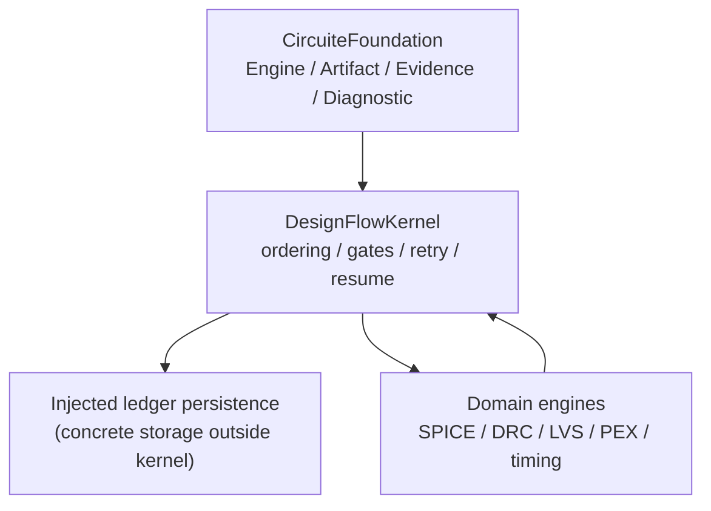

# DesignFlowKernel design

## Responsibility boundary

DesignFlowKernel coordinates a semiconductor design flow. It does not
implement domain algorithms and it does not become a project model. Domain
engines remain independently executable and are supplied through
`FlowStageExecutor`.

## Foundation integration

- `FlowEngine` is the typed `CircuiteFoundation.Engine` boundary.
- `DefaultFlowEngine` adapts the existing orchestrator without changing its
  trust, approval, retry, or resume semantics.
- `DesignFlowFoundationEvidence` projects completed stage artifacts and
  diagnostics into `EvidenceManifest` and `DesignDiagnostic`.
- Evidence promotion is fail-closed. Missing or invalid SHA-256 and byte
  count metadata is a typed boundary error.
- `FlowRunLedgerPersisting` is the asynchronous storage seam for run recovery.
  Implementations own durable writes and integrity checks; the kernel does not
  choose a filesystem layout.
- `FlowExecutionStorage` is Foundation-first for new artifact operations:
  `makeArtifactReference` returns `CircuiteFoundation.ArtifactReference` and
  `registerArtifact` accepts that canonical value. Legacy `fileReference` and
  run-artifact registration is performed through the canonical workspace storage
  boundary and is not exposed as a compatibility entry point.
- `FlowOperationRequest`, stage results, and the run ledger remain domain and
  persistence models owned by this package.

## Runtime flow

1. A caller creates a `FlowEngineRequest` with a `FlowOperationRequest`, tool
   registry, health results, and stage executors.
2. `DefaultFlowEngine.execute` delegates to `DefaultFlowOrchestrator`.
3. The orchestrator validates the plan, selects trusted tools, executes stages,
   records diagnostics and artifacts, and applies approval gates.
4. A `FlowRunLedgerPersisting` implementation persists the run so a later
   invocation can resume the same run. Xcircuite supplies the concrete
   `.xcircuite` implementation.
5. A caller may project a completed `FlowRunResult` to Foundation evidence by
   supplying an `ExecutionProvenance` value. The projection preserves artifact
   IDs when present, derives a deterministic identity when legacy IDs are
   absent, and rejects missing integrity metadata.

## Deliberate non-goals

- No universal result envelope is introduced.
- No project lifecycle or UI state is moved into Foundation.
- No domain-specific artifact formats are interpreted by the kernel.
- The former `Xcircuite workspace` storage API is frozen during migration and is
  not part of the new kernel contract.
