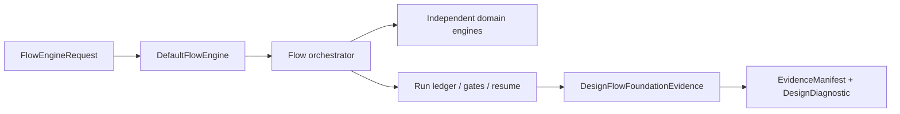
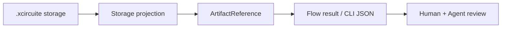

# DesignFlowKernel

## CircuiteFoundation boundary

DesignFlowKernel is an independent flow coordinator. It owns stage ordering,
tool trust gates, retry policy, approval decisions, run persistence, and resume.
It does not own circuit, layout, simulation, DRC, LVS, or PEX algorithms.
`CircuiteFoundation` supplies the shared `Engine`, artifact, evidence,
provenance, diagnostic, and design-object contracts.



Use `DefaultFlowEngine` when a caller needs the Foundation `Engine` protocol;
use `DefaultFlowOrchestrator` directly when constructing a flow with explicit
runtime dependencies. `DesignFlowFoundationEvidence` is the cross-engine view
and is deliberately strict: an artifact without a valid SHA-256 digest and
byte count cannot be promoted to Foundation evidence.

### Canonical artifact results

Build and evaluation result envelopes expose `CircuiteFoundation.ArtifactReference`
directly. This includes decision packets, stage-artifact ladders, cross-artifact
evaluations, loop summaries and evidence coverage, release-evidence collections,
and retention indexes. Result
decoders require Foundation's locator, role, kind, format, digest, byte count,
and producer fields; malformed or obsolete shapes are rejected.



The filesystem manifest is an external storage boundary; flow APIs must use
`FlowExecutionStorage.makeArtifactReference` and `registerArtifact` instead of
constructing a filesystem-specific file record. Unsupported record shapes are
rejected at the decode boundary.

Persistence is injected through `FlowRunLedgerPersisting`; the kernel does not
select a filesystem format or create a `.xcircuite` directory. `Xcircuite`
provides the concrete `XcircuiteWorkspaceStore` and
`XcircuiteRunLedgerStore` implementations. The Foundation boundary is an
explicit projection from a flow result, while lifecycle and approval remain
kernel-owned.

Shared flow kernel for the semiconductor design platform. Humans (circuit-studio),
agents, and CI run the same flow through this kernel so that tool selection, trust
gates, stage results, and artifacts have one meaning. The kernel owns ordering,
gating, persistence, and resume — it contains no SPICE/DRC/LVS/PEX domain logic
(that stays in the engine packages, connected via the `Xcircuite` runtime).

## Xcircuite integration

[`Xcircuite`](https://github.com/1amageek/Xcircuite) is the umbrella runtime
that supplies concrete workspace/run-ledger persistence and domain stage
executors to this kernel. `DesignFlowKernel` remains independent of the
`.xcircuite` filesystem and owns lifecycle, gates, approvals, retries, and
resume.

## Types

| Type | Responsibility |
|---|---|
| `FlowOperationRequest` | Project root, run ID, intent, stage sequence |
| `FlowStageDefinition` | Stage ID, display name, tool trust requirement, `requiresApproval`, retry policy |
| `FlowStageExecutor` | Protocol: delegates domain-specific stage execution to engine adapters |
| `DefaultFlowOrchestrator` | Applies tool trust gates, executes stages, applies the approval gate, and persists results through an injected ledger boundary |
| `FlowStageResult` / `FlowStageStatus` | Typed stage outcome: status, diagnostics, gate results, artifact references, attempt records |
| `FlowStageRetryPolicy` / `FlowStageAttemptRecord` | Bounded stage retry contract and persisted per-attempt audit trail |
| `FlowGateResult` / `FlowGateStatus` | Pass/fail/waived/incomplete per gate |
| `FlowRunResult` / `FlowRunStatus` | Run status, run directory, stage results |
| `FlowDiagnostic` / `FlowDiagnosticSeverity` | Structured diagnostics (never opaque strings) |
| `FlowExecutionContext` / `FlowExecutionError` | Execution environment and typed failures |
| `FlowRunLedgerSummary` | Compact Agent / CI summary with stage, gate, toolchain, diagnostic, next-action, and selected suggested-command state |
| `FlowRunReviewBundle` | Human / Agent review contract with checklist items, approval records, artifact IDs, artifact paths, and artifact integrity status for cockpit consumption |
| `FlowRunProgressSnapshot` | Cursor-based progress event view over `progress.jsonl` |
| `FlowRunProgressSubscriptionRequest` / `DefaultFlowRunProgressSubscriber` | Bounded polling subscription for live progress snapshots and JSONL follow mode |

## Retry policy

Stages can opt into bounded retry through `FlowStageDefinition.retryPolicy`.
The policy is diagnostic-code based: a failed attempt is retried only when its
diagnostics contain a configured retryable code and the attempt count is still
below `maxAttempts`. Blocked stages, approval waits, successful stages, and
observed cancellation are not retried.

The orchestrator records every attempt in `FlowStageResult.attempts`. When a
stage has retry enabled or more than one attempt, it also writes
`runs/<run-id>/stages/<stage-id>/attempts.json`, registers it in the run
manifest with artifact ID `<stage-id>-attempts`, exposes it as `stage-attempts`
in the review bundle, and reports `attemptCount` / `retryCount` through
`FlowRunLedgerSummary`. This keeps retry policy reviewable without scraping
process logs.

## Progress subscription

`progress.jsonl` is the source of truth for live run progress. `DefaultFlowRunProgressSubscriber`
provides cursor-based snapshots and bounded polling so cockpit and Agent clients
can follow a long-running flow without tailing files or scraping tool logs. The
subscriber stops when a terminal `runFinished` event is observed unless the caller
opts into terminal history reads.

CLI:

```bash
design-flow progress-run --project-root <path> --run-id <id> --pretty
design-flow progress-run --project-root <path> --run-id <id> --since-sequence <n> --wait --timeout-milliseconds 30000
design-flow progress-run --project-root <path> --run-id <id> --since-sequence <n> --follow --timeout-milliseconds 30000
```

`--follow` emits compact `FlowRunProgressEvent` JSONL, one event per line. Bounded
timeouts keep the command suitable for Agent loops, CI probes, and cockpit
polling workers.

## Approval gate and resume

Stages with `requiresApproval` evaluate an `approval` gate after execution, read from
`runs/<run-id>/approvals/<stage-id>.json` (`FlowApprovalRecord`, latest wins):

| Approval state | Gate result | Run behavior |
|---|---|---|
| approved | passed | continue to the next stage |
| waived with a non-empty review reason | passed with `STAGE_WAIVED` warning | continue while preserving the evidence-bound exception |
| rejected | failed (`STAGE_REJECTED`) | stage fails, run fails |
| absent | — | run stops as `blocked` (`APPROVAL_PENDING`) |

Approval and waiver decisions bind the exact plan and stage-result artifact
references reviewed by the human. A waiver without a reason is rejected.

Resume is re-running the same runID: `approvals/` survives run directory re-creation,
so recording a decision and re-running moves past the gate. The review cockpit and
the agent both operate on this one ledger — block → decide → resume.

## Release envelope and retention evidence

Release readiness is fail-closed and requires both the raw ReleaseEngine qualification
result and an append-only retention index. The qualification result must be completed,
qualified, promoted beyond `blocked`, scope-complete, and free of blocked or failed
lanes. The retention index binds a source dashboard and JSONL history by SHA-256,
byte count, entry count, and head digest; every history entry is hash-chained and the
index records the minimum retention window and append-only advancement.

Developer and Agent callers can create and revalidate the same artifact contract:

```bash
design-flow build-retention-index --project-root <path> --run-id <id> --workflow-run-id <id> --source-dashboard <path> --history <path> --previous-entry-count <n> --retention-days <n> --minimum-retention-days <n>
design-flow validate-retention-index --project-root <path> --run-id <id>
design-flow build-release-envelope --project-root <path> --run-id <id>
```

`build-retention-index` writes
`.xcircuite/runs/<run-id>/qualification/retention-index.json`, registers
`qualification-retention-index` in the run manifest, and returns a structured
non-zero result when the evidence is blocked. `build-release-envelope` then
content-validates the qualification result and retention index instead of relying

The repository-owned `.github/workflows/retention.yml` builds the CLI, runs the
retention regression suite, generates a hash-chained retained history through
`Fixtures/Retention/generate-retention-fixture.py`, executes both retention CLI
commands, and uploads the run artifacts with a 90-day retention setting.
`build-retention-index` initializes a missing run directory so the same contract
is directly reproducible from a clean CI workspace.

## Review contract

`DefaultFlowRunReviewBundler` loads a `FlowRunLedger` through the injected ledger
boundary and emits a `FlowRunReviewBundle`. The bundle does not invent UI
state. It points review items back to ledger artifacts such as `manifest.json`,
`plan.json`, `toolchain.json`, `design-diff.json`, stage `result.json`, stage
artifacts, and approval records. Stage artifacts preserve their stable
`artifactID`; artifacts whose ID ends in `-summary` are exposed with role
`stage-summary` so DRC/LVS/PEX compact review reports can be found without path
guessing. Stage artifacts also carry `integrity.status`, `expectedSHA256`,
`actualSHA256`, `expectedByteCount`, and `actualByteCount` when verification is
possible. Missing files, missing digests, missing byte counts, invalid digests,
invalid byte counts, byte-count mismatches, digest mismatches, invalid paths, and
unreadable artifacts become typed review state instead of silent UI warnings. The
underlying path, symlink, digest, and byte-count checks come from the
Foundation `LocalArtifactVerifier`; the concrete Xcircuite workspace store
applies the filesystem boundary before the kernel receives a ledger.
Failed or incomplete `*-artifacts` gates are surfaced separately as artifact
coverage repair work, which lets agents distinguish "the engine found a design
problem" from "the engine produced evidence that the flow ledger did not index."
When `planning/plan-verification.json` contains `correctnessGateResults`, the
review bundle also projects non-passing planning correctness gates as
`planningCorrectness` review items so Human and Agent reviewers can distinguish
design signoff failures from planning-translation, action-domain, replay,
post-execution, or feedback-closure gaps. The same gates also appear in
`inspect-run` summaries as `verifyPlanningCorrectness` or
`repairPlanningCorrectness` next actions with `suggestedCommands`. Commands that
can run immediately are marked `ready`; follow-ups that first need a planning
artifact edit are marked `requiresInput`, so lightweight Agent polling does not
have to open the full review bundle before choosing the next command. When a
run has a `planning/problem.json` artifact and non-empty `planning/rejected-plans.jsonl`
feedback, the review bundle exposes a `planning-rejected-feedback` diagnostic
review item and `inspect-run` emits a ready `regenerateCandidatePlanWithFeedback`
suggested command for feedback-aware candidate-plan generation. When a
human or cockpit records a `review.selectSuggestedCommand` action in
`actions.jsonl`, `inspect-run` also emits it through
`suggestedCommandSelections`, preserving the reviewer, next action ID, command ID,
readiness, executable, arguments, and reason as typed continuation input.

| Review item | Meaning |
|---|---|
| `designDiff` | Proposed design changes need review |
| `approvalGate` | A stage is waiting for approval, or approval was recorded and the run is ready to resume |
| `toolTrust` | Tool evidence or trust selection needs repair |
| `stageFailure` / `stageBlocker` | A stage needs diagnostic review before retry |
| `diagnosticReview` | A succeeded stage produced warnings worth inspecting |
| `artifactIntegrity` | One or more stage artifacts cannot be verified from the ledger path, digest, and byte count |
| `artifactCoverage` | A domain artifact manifest gate reports outputs that are missing from the flow ledger |

CLI:

```bash
design-flow inspect-run --project-root <path> --run-id <id> --pretty
design-flow review-run --project-root <path> --run-id <id> --pretty
design-flow progress-run --project-root <path> --run-id <id> --pretty
design-flow approve-gate --project-root <path> --run-id <id> --stage-id <id> --verdict <approved|rejected> --reviewer <id> --pretty
```

## Dependencies

`CircuiteFoundation` (shared engine/evidence/artifact contracts),
`Xcircuite workspace` (local `.xcircuite/` run ledger and persistence), and
`ToolQualification` (tool trust gates). Foundation is the cross-package
contract; DesignFlowKernel remains the owner of flow lifecycle and resume.

## Build & test

```bash
swift build
swift test
```
