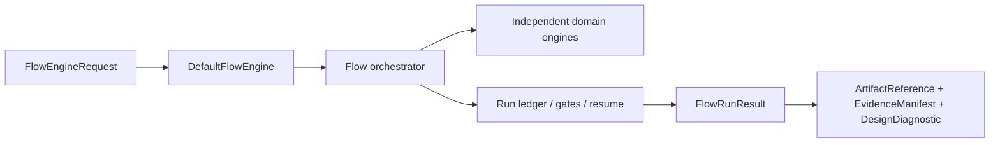
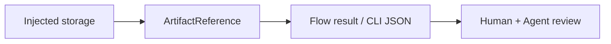

# DesignFlowKernel

## Shared contracts

DesignFlowKernel is an independent flow coordinator. It owns stage ordering,
tool trust gates, retry policy, approval decisions, run persistence, and resume.
It does not own circuit, layout, simulation, DRC, LVS, or PEX algorithms.
`CircuiteFoundation` supplies the shared `Engine`, artifact, evidence,
provenance, diagnostic, and design-object contracts.



`FlowRunResult` directly conforms to `ArtifactProducing`,
`EvidenceProviding`, and `DiagnosticReporting`. Every result therefore carries
valid execution provenance, canonical artifacts, and structured diagnostics;
there is no projection wrapper or generic result envelope.

### Canonical artifact results

Build and evaluation result envelopes expose `CircuiteFoundation.ArtifactReference`
directly. This includes decision packets, stage-artifact ladders, cross-artifact
evaluations, loop summaries and evidence coverage, release-evidence collections,
and retention indexes. Result
decoders require Foundation's locator, role, kind, format, digest, byte count,
and producer fields; malformed or obsolete shapes are rejected.



Storage is an injected boundary. Flow code persists and loads canonical
`ArtifactReference` values through `FlowArtifactPersisting`; the implementation
owns namespace resolution, atomic writes, and storage integrity. Unsupported
record shapes are rejected at the decode boundary.

Persistence is injected through `FlowRunLedgerPersisting`; the kernel does not
select a filesystem format or accept path roots. A composing application binds
an opaque `FlowWorkspaceID` to concrete storage before invoking the kernel.

Shared flow kernel for the semiconductor design platform. Humans (circuit-studio),
agents, and CI run the same flow through this kernel so that tool selection, trust
gates, stage results, and artifacts have one meaning. The kernel owns ordering,
gating, persistence, and resume — it contains no SPICE/DRC/LVS/PEX domain logic
(that stays in the engine packages, connected via the `Xcircuite` runtime).

## Xcircuite integration

[`Xcircuite`](https://github.com/1amageek/Xcircuite) is the umbrella runtime
that supplies concrete workspace/run-ledger persistence and domain stage
executors to this kernel. `DesignFlowKernel` remains storage-layout independent
and owns lifecycle, gates, approvals, retries, and resume.

## Types

| Type | Responsibility |
|---|---|
| `FlowWorkspaceID` | Validated opaque identity resolved by the composing storage layer |
| `FlowOperationRequest` | Workspace identity, run ID, intent, stage sequence |
| `FlowStageDefinition` | Stage ID, display name, tool trust requirement, `requiresApproval`, retry policy |
| `FlowStageExecutor` | Protocol: delegates domain-specific stage execution to engines |
| `DefaultFlowOrchestrator` | Applies tool trust gates, executes stages, applies the approval gate, and persists results through an injected ledger boundary |
| `FlowStageResult` / `FlowStageStatus` | Typed stage outcome: status, diagnostics, gate results, artifact references, attempt records |
| `FlowStageRetryPolicy` / `FlowStageAttemptRecord` | Bounded stage retry contract and persisted per-attempt audit trail |
| `FlowGateResult` / `FlowGateStatus` | Pass/fail/waived/incomplete per gate |
| `FlowRunResult` / `FlowRunStatus` | Run status, stage results, canonical evidence, provenance, and diagnostics |
| `FlowDiagnostic` / `FlowDiagnosticSeverity` | Structured diagnostics (never opaque strings) |
| `FlowExecutionContext` / `FlowExecutionError` | Execution environment and typed failures |
| `FlowRunLedgerSummary` | Compact Agent / CI summary with stage, gate, toolchain, diagnostic, next-action, and selected semantic-action state |
| `FlowRunReviewLedgerLoading` | Structurally validated metadata load for per-artifact human review; missing or corrupted evidence remains visible in the review bundle |
| `FlowRunReviewBundle` | Human / Agent review contract with checklist items, approval records, canonical Foundation artifact references, flow-review purposes, and artifact integrity status for cockpit consumption |
| `FlowRunProgressSnapshot` | Cursor-based progress event view over `progress.jsonl` |
| `FlowRunProgressSubscriptionRequest` / `DefaultFlowRunProgressSubscriber` | Bounded polling subscription for live progress snapshots and JSONL follow mode |

## Retry policy

Stages can opt into bounded retry through `FlowStageDefinition.retryPolicy`.
The policy is diagnostic-code based: a failed attempt is retried only when its
diagnostics contain a configured retryable code and the attempt count is still
below `maxAttempts`. Blocked stages, approval waits, successful stages, and
observed cancellation are not retried.

The orchestrator records every attempt in `FlowStageResult.attempts`. When a
stage has retry enabled or more than one attempt, it also writes
`runs/<run-id>/stages/<stage-id>/attempts.json`, registers it in the run
manifest with artifact ID `<stage-id>-attempts`, exposes it as `stage-attempts`
in the review bundle, and reports `attemptCount` / `retryCount` through
`FlowRunLedgerSummary`. This keeps retry policy reviewable without scraping
process logs.

## Progress subscription

`progress.jsonl` is the source of truth for live run progress. `DefaultFlowRunProgressSubscriber`
provides cursor-based snapshots and bounded polling so cockpit and Agent clients
can follow a long-running flow without tailing files or scraping tool logs. The
subscriber stops when a terminal `runFinished` event is observed unless the caller
opts into terminal history reads.

The kernel publishes this as a library API. A composing runtime may expose the
cursor and bounded polling operations through its own CLI without moving
filesystem ownership into this package.

## Approval gate and resume

Stages with `requiresApproval` evaluate an `approval` gate after execution, read from
the immutable `runs/<run-id>/approvals/<stage-id>.json` `FlowApprovalRecord`.
Only one decision may be recorded for a stage:

| Approval state | Gate result | Run behavior |
|---|---|---|
| approved | passed | continue to the next stage |
| waived with a non-empty review reason | passed with `STAGE_WAIVED` warning | continue while preserving the evidence-bound exception |
| rejected | failed (`STAGE_REJECTED`) | stage fails, run fails |
| absent | — | run stops as `blocked` (`APPROVAL_PENDING`) |

Before recording an approval or waiver, the recorder verifies the canonical stage
result and retains its exact bytes as an immutable, content-addressed action output:

```text
stages/<stage-id>/result.json
  -> review/approval-inputs/<stage-id>-<sha256>.json
  -> FlowApprovalRecord.evidence.stageResult
  -> approval action input
```

The retention action is append-only and retry-safe. Its identity and timestamp are
derived from persisted run state, so a process restart between retaining the reviewed
result and appending the approval can resume without creating different evidence.
The approval binds the exact plan reference and retained result snapshot. The
canonical stage result may then be updated during resume without changing the bytes
that the reviewer approved. A waiver without a reason is rejected.

Resume is re-running the same runID: persisted approvals survive run-state re-creation,
so recording a decision and re-running moves past the gate. The review cockpit and
the agent both operate on this one ledger — block → decide → resume.

## Release envelope and retention evidence

Release readiness is fail-closed and requires both the raw ReleaseEngine qualification
result and an append-only retention index. The qualification result must be completed,
qualified, promoted beyond `blocked`, scope-complete, and free of blocked or failed
lanes. The retention index binds a source dashboard and JSONL history by SHA-256,
byte count, entry count, and head digest; every history entry is hash-chained and the
index records the minimum retention window and append-only advancement.

Developer and Agent callers use `FlowRunReleaseRetentionIndexBuilding`,
`FlowRunReleaseRetentionIndexValidating`, and `FlowRunReleaseEnvelopeBuilding`
with injected artifact persistence. The kernel validates the retained evidence;
it does not choose a storage path or expose a package-owned executable.
Tool qualification and release policy decisions remain inputs from
ToolQualification and the composing flow, rather than claims made by a domain
engine.

`DefaultFlowRunReleaseEvidenceCollector` also requires an injected
`ProducerIdentity`. Its corpus history, performance envelope, and contract audit
are active-run results, so each is persisted in replaceable mode until the run
becomes terminal. The persistence boundary must return the exact injected
producer on every reference; a missing or rewritten producer is a typed failure.

## Review contract

`DefaultFlowRunReviewBundler` loads a `FlowRunLedger` through the injected ledger
boundary and emits a `FlowRunReviewBundle`. The bundle does not invent UI
state. Schema version 2 points review items back to ledger artifacts such as `manifest.json`,
`plan.json`, `toolchain.json`, `design-diff.json`, stage `result.json`, stage
artifacts, and approval records. Each `FlowRunReviewArtifact` owns one canonical
`ArtifactReference`; identity, locator, role, kind, format, digest, and byte count
are read from that reference rather than copied into a second record. The
flow-domain `FlowRunReviewArtifactPurpose` is a validated open token; its
`purpose` value classifies references whose ID ends in `-summary` as
`stage-summary` so DRC/LVS/PEX compact review reports can be found without path
guessing. Stage artifacts also carry `integrity.status`, `expectedSHA256`,
`actualSHA256`, `expectedByteCount`, and `actualByteCount` when verification is
possible. Missing files, missing digests, missing byte counts, invalid digests,
invalid byte counts, byte-count mismatches, digest mismatches, invalid paths, and
unreadable artifacts become typed review state instead of silent UI warnings. The
underlying path, symlink, digest, and byte-count checks come from the
Foundation `LocalArtifactVerifier`; the concrete Xcircuite workspace store
applies the filesystem boundary before the kernel receives a ledger.
An expected artifact without a canonical ledger reference is reported as a
missing requirement or review item; the kernel does not manufacture a synthetic
artifact reference with placeholder digest or byte-count claims.
Because a decision packet embeds the review bundle, both schemas are version 3
and validation rejects packets carrying any other review-bundle schema.
Failed or incomplete `*-artifacts` gates are surfaced separately as artifact
coverage repair work, which lets agents distinguish "the engine found a design
problem" from "the engine produced evidence that the flow ledger did not index."
When `planning/plan-verification.json` contains `correctnessGateResults`, the
review bundle also projects non-passing planning correctness gates as
`planningCorrectness` review items so Human and Agent reviewers can distinguish
design signoff failures from planning-translation, action-domain, replay,
post-execution, or feedback-closure gaps. The same gates also appear in
`inspect-run` summaries as `verifyPlanningCorrectness` or
`repairPlanningCorrectness` next actions with `suggestedActions`. Actions that
can run immediately are marked `ready`; follow-ups that first need a planning
artifact edit are marked `requiresInput`, so lightweight Agent polling does not
have to open the full review bundle before choosing the next operation. When a
run has a `planning/problem.json` artifact and non-empty `planning/rejected-plans.jsonl`
feedback, the review bundle exposes a `planning-rejected-feedback` diagnostic
review item and `inspect-run` emits a ready `regenerateCandidatePlanWithFeedback`
semantic action for feedback-aware candidate-plan generation. The action carries
the operation, run ID, readiness, and typed associated values without naming an
executable or encoding CLI arguments. When a human or cockpit records a
`review.selectSuggestedAction` action in
`actions.jsonl`, `inspect-run` also emits it through
`suggestedActionSelections`, preserving the reviewer, next action ID, semantic
operation, readiness, associated values, and reason as typed continuation input. Xcircuite
may project that action into its current CLI using the concrete project root.

| Review item | Meaning |
|---|---|
| `designDiff` | Proposed design changes need review |
| `approvalGate` | A stage is waiting for approval, or approval was recorded and the run is ready to resume |
| `toolTrust` | Tool evidence or trust selection needs repair |
| `stageFailure` / `stageBlocker` | A stage needs diagnostic review before retry |
| `diagnosticReview` | A succeeded stage produced warnings worth inspecting |
| `artifactIntegrity` | One or more stage artifacts cannot be verified from the ledger path, digest, and byte count |
| `artifactCoverage` | A domain artifact manifest gate reports outputs that are missing from the flow ledger |

Inspection, review, progress, and approval are library contracts. Xcircuite or
another composing application may project them into a CLI or UI while supplying
the concrete storage implementation.

## Dependencies

`CircuiteFoundation` (shared engine/evidence/artifact contracts),
an application-owned workspace store (run ledger and persistence), and
`ToolQualification` (tool trust gates). Foundation is the cross-package
contract; DesignFlowKernel remains the owner of flow lifecycle and resume.

## Build & test

```bash
swift build
swift test
```
